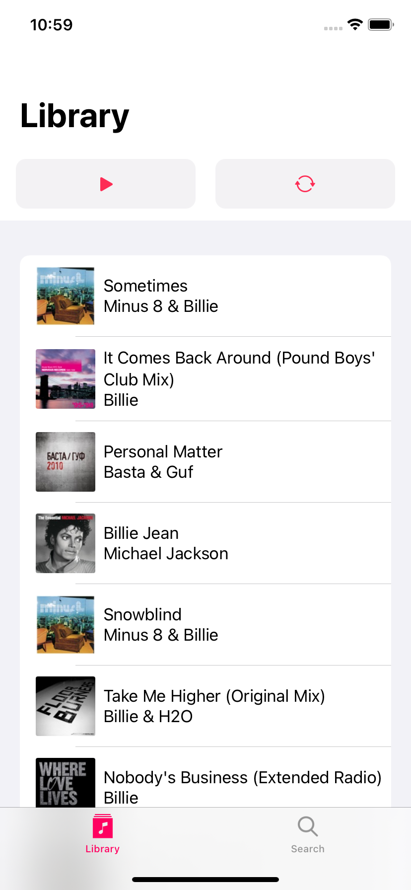
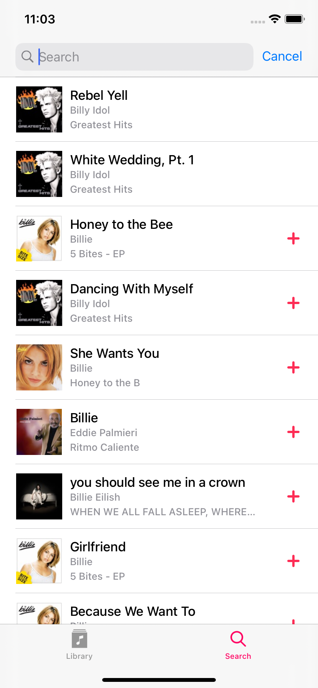
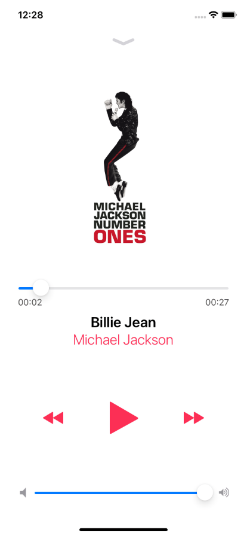
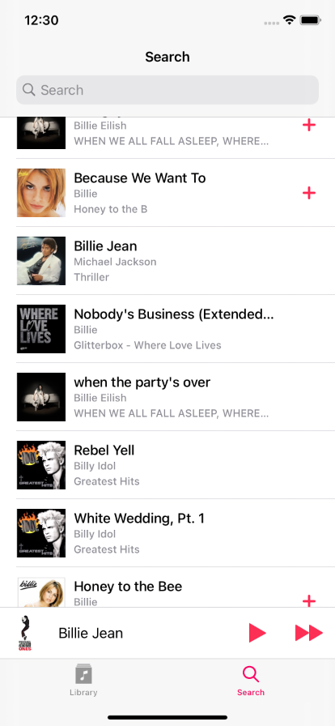

# Apple ITunes AudioPlayer 

- Clean Swift Architecture
- UIKit And SwiftUI
- Custom View From a XIB
- Play tracks with AVPlayer
- Save tracks to UserDefaults
- Alamofire
- SDWebImage
- URLImage for SwiftUI

​
​
​
​
